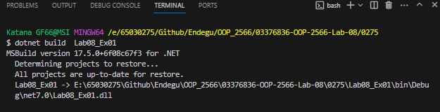
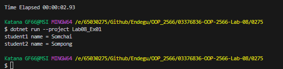

สร้างอ็อบเจกต์ student1 ของคลาส Student และกำหนดค่า Name เป็น "Somchai" จากนั้นแสดงค่า Name ของ student1
สร้างอ็อบเจกต์ student2 โดยใช้ var และกำหนดค่า Name เป็น "Sompong" จากนั้นแสดงค่า Name ของ student2