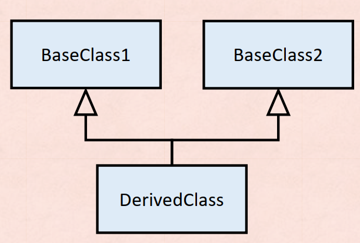

# Lab 8 Exercise 3

## Class inheritance 1



1. สร้าง console application project

```cmd
dotnet new console --name Lab08_Ex03
```

2.เปลี่ยน code ให้เป็นดังต่อไปนี้

```cs
DerivedClass dc = new DerivedClass();
class BaseClass1
 {
    public BaseClass1()
    {
        System.Console.WriteLine("This is BaseClass1");
    }
 }
class BaseClass2
 {
    public BaseClass2()
    {
        System.Console.WriteLine("This is BaseClass2");
    }
 }

class DerivedClass : BaseClass1
{
    public DerivedClass()
    {
        System.Console.WriteLine("This is DerivedClass");
    }
}
```

3.Build project โดยการใช้คำสั่ง

```cmd
dotnet build  Lab08_Ex03
```

ถ้ามีที่ผิดพลาดในโปรแกรม ให้แก้ไขให้ถูกต้อง

4.บันทึกผลที่ได้จากการรันคำสั่งในข้อ 3


5.Run project โดยการใช้คำสั่ง

```cmd
dotnet run --project Lab08_Ex03
```

6.บันทึกผลที่ได้จากการรันคำสั่งในข้อ 5


7.อธิบายสิ่งที่พบในการทดลอง

สามารถ Run ได้ เพราะ เป็นการสืบทดอ Class อย่างถูกต้อง
โปรแกรมจะแสดงผล
This is BaseClass1
This is DerivedClass
