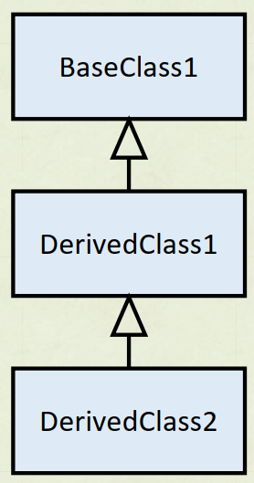

# Lab 8 Exercise 6

## Multiple base class inheritance



1. สร้าง console application project

```cmd
dotnet new console --name Lab08_Ex06
```


2.เปลี่ยน code ให้เป็นดังต่อไปนี้

```cs
DerivedClass dc = new DerivedClass();
class BaseClass1
 {
    public BaseClass1()
    {
        System.Console.WriteLine("This is BaseClass1");
    }
 }
class BaseClass2: BaseClass1
 {
    public BaseClass2()
    {
        System.Console.WriteLine("This is BaseClass2");
    }
 }

class DerivedClass : BaseClass2
{
    public DerivedClass()
    {
        System.Console.WriteLine("This is DerivedClass");
    }
}
```


3.Build project โดยการใช้คำสั่ง

```cmd
dotnet build  Lab08_Ex06
```

ถ้ามีที่ผิดพลาดในโปรแกรม ให้แก้ไขให้ถูกต้อง

4.บันทึกผลที่ได้จากการรันคำสั่งในข้อ 3


5.Run project โดยการใช้คำสั่ง

```cmd
dotnet run --project Lab08_Ex06
```

6.บันทึกผลที่ได้จากการรันคำสั่งในข้อ 5


7.อธิบายสิ่งที่พบในการทดลอง

จากการทดลองนี้มีการสร้างคลาส DerivedClass, BaseClass1, และ BaseClass2 ในภาษา C# DerivedClass เป็นคลาสที่สืบทอดจาก BaseClass2 โดยมีการสร้างคอนสตรักเตอร์ที่แสดงข้อความ "This is DerivedClass" ผ่านคอนโสตรักเตอร์ของ DerivedClass

BaseClass2 เป็นคลาสที่สืบทอดจาก BaseClass1 โดยมีการสร้างคอนสตรักเตอร์ที่แสดงข้อความ "This is BaseClass2" ผ่านคอนโสตรักเตอร์ของ BaseClass2

BaseClass1 เป็นคลาสที่มีคอนสตรักเตอร์ที่แสดงข้อความ "This is BaseClass1" 

ผ่านคอนโสตรักเตอร์ของ BaseClass1 เมื่อสร้างอ็อบเจกต์ dc ของคลาส DerivedClass จะเกิดการเรียกใช้คอนสตรักเตอร์ของ DerivedClass ซึ่งจะแสดงข้อความ "This is DerivedClass" ผ่านทางคอนโสตรักเตอร์ของ DerivedClass และเนื่องจาก BaseClass2 สืบทอดจาก BaseClass1 จึงเกิดการเรียกใช้คอนสตรักเตอร์ของ BaseClass2 และ BaseClass1 ตามลำดับ ซึ่งจะแสดงข้อความ "This is BaseClass2" และ "This is BaseClass1" ตามลำดับด้วย 

ผลลัพธ์ที่ได้

This is BaseClass1

This is BaseClass2

This is DerivedClass

ดังการแสดงภาพด้านบน
